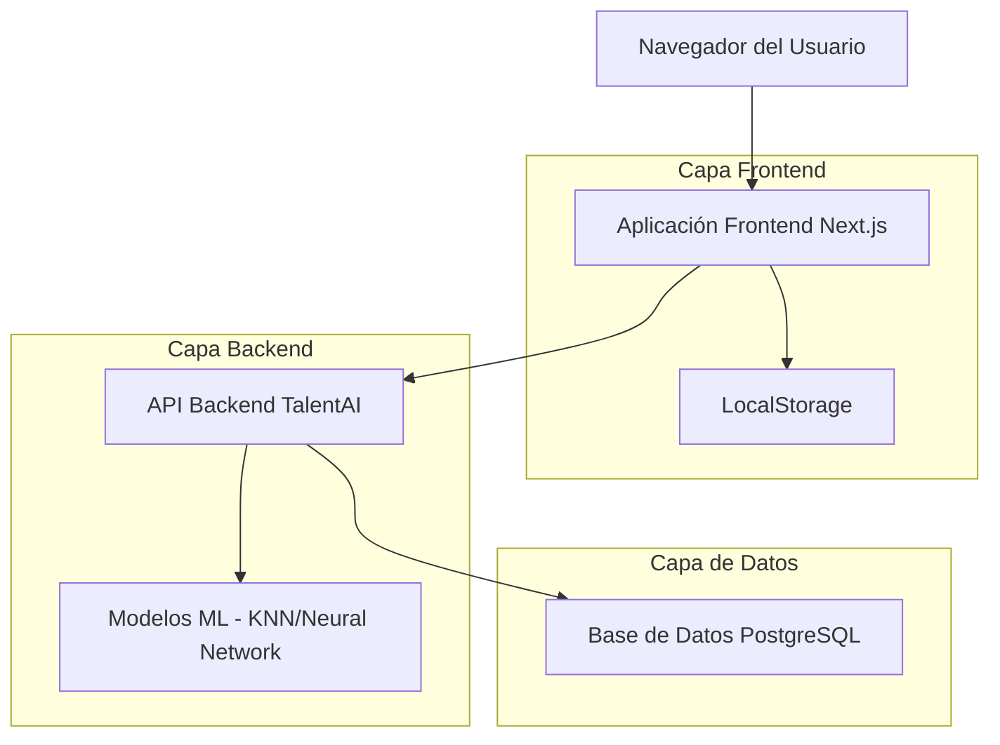

# 🎓 TalentAI - Sistema Inteligente de Orientación Vocacional

## 📋 Información del Proyecto

**Proyecto de Grado** - Especialización en Ciencias de Datos y Analítica  
**Autora:** Erika Monroy  
**Tipo:** Proyecto Académico  

## 🎯 Descripción del Proyecto

TalentAI es una plataforma inteligente de orientación vocacional diseñada para ayudar a estudiantes de 10° y 11° grado de Bogotá a descubrir qué programas de educación superior se ajustan mejor a sus intereses, competencias y metas de vida.

### 🔍 Problema a Resolver
- Reducir la deserción en los primeros semestres universitarios
- Evitar que más jóvenes caigan en la condición de NINI (Ni estudian, Ni trabajan)
- Brindar una herramienta gratuita, accesible y personalizada de orientación vocacional

## 🏗️ Arquitectura del Sistema

El proyecto está compuesto por tres componentes principales:

### 1. 🤖 Modelos de Machine Learning
- **Redes Neuronales:** Ofrecen la predicción más precisa
- **K-Nearest Neighbors (KNN):** Garantiza rapidez y eficiencia en los resultados
- **Comparación de modelos:** Análisis exhaustivo de rendimiento y precisión

#### Modelos Implementados y Comparados:

1. **Logistic Regression** - Modelo lineal interpretable
   - Algoritmo base para clasificación multiclase
   - Optimización con regularización L1/L2
   - Tiempo de entrenamiento: ~33 segundos

2. **Random Forest** - Ensemble con interpretabilidad
   - 300 árboles de decisión con criterio entropy
   - Análisis de importancia de características
   - Out-of-bag score para validación
   - Tiempo de entrenamiento: ~176 segundos

3. **XGBoost** - Gradient boosting optimizado
   - Optimización de hiperparámetros con Optuna
   - 343 estimadores con profundidad máxima de 4
   - Regularización avanzada (alpha/lambda)
   - Tiempo de entrenamiento: ~328 segundos

4. **Neural Network** - Deep learning con TensorFlow/Keras
   - Arquitectura: 256→128→64→30 neuronas
   - Dropout (0.3) y BatchNormalization
   - Early stopping y reducción de learning rate
   - Tiempo de entrenamiento: ~180 segundos

5. **K-Nearest Neighbors (KNN)** - Algoritmo basado en similitud
   - Optimización del número de vecinos (k=7)
   - Pesos por distancia uniforme
   - Algoritmo ball_tree para eficiencia
   - Tiempo de entrenamiento: ~2 segundos

#### Métricas de Evaluación:
- **Accuracy**: Precisión general del modelo
- **F1-Score (Macro)**: Promedio balanceado por clase
- **F1-Score (Weighted)**: Promedio ponderado por frecuencia
- **Cross-Validation**: Validación cruzada 5-fold
- **Confusion Matrix**: Análisis detallado por clase

### 2. 🎨 Frontend (Next.js)
- Interfaz de usuario intuitiva y moderna
- Formulario de evaluación de 100 preguntas
- 8 dimensiones de competencias evaluadas
- Visualización de resultados y recomendaciones

### 3. ⚙️ Backend (FastAPI)
- API REST para procesamiento de datos
- Integración con modelos de ML
- Gestión de base de datos PostgreSQL
- Procesamiento de evaluaciones en tiempo real

## Diseño de Arquitectura



## 📊 Datos del Sistema

- **2,281 programas académicos** registrados
- Cobertura de universidades, institutos tecnológicos y SENA
- Base de datos completa de la oferta educativa de Bogotá
- Sistema de matching inteligente basado en competencias

## 🚀 Funcionalidades Principales

✅ **Evaluación Integral:** Formulario de 100 preguntas en 8 dimensiones  
✅ **Recomendaciones Personalizadas:** Algoritmos de ML para matching preciso  
✅ **Análisis Comparativo:** Múltiples modelos de predicción  
✅ **Interfaz Amigable:** Experiencia de usuario optimizada  
✅ **Resultados Inmediatos:** Procesamiento en tiempo real  

## 🛠️ Tecnologías Utilizadas

### Machine Learning
- Python
- TensorFlow/Keras (Redes Neuronales)
- Scikit-learn (KNN y otros algoritmos)
- Pandas, NumPy (Procesamiento de datos)
- Jupyter Notebooks (Análisis y experimentación)

### Frontend
- Next.js 14
- TypeScript
- Tailwind CSS
- React Hook Form
- Zustand (State Management)

### Backend
- FastAPI
- PostgreSQL
- SQLAlchemy
- Pydantic
- Docker

## 📁 Estructura del Proyecto

```
talent_ai/
├── backend/          # API y servicios backend
├── frontend/         # Aplicación web Next.js
├── modelo/           # Modelos ML y análisis
│   ├── data/         # Datasets y archivos de datos
│   ├── models/       # Implementación de algoritmos ML
└── README.md        # Este archivo
```

## 🎯 Objetivos Académicos

1. **Comparación de Modelos ML:** Análisis exhaustivo del rendimiento de diferentes algoritmos de machine learning en el contexto de orientación vocacional

2. **Desarrollo Full-Stack:** Implementación completa de una solución tecnológica que integre ML, backend y frontend

3. **Aplicación Práctica:** Creación de una herramienta con impacto social real en la educación y orientación vocacional

4. **Investigación Aplicada:** Contribución al campo de la analítica educativa y sistemas de recomendación

## 📈 Impacto Esperado

- **Estudiantes:** Mejor toma de decisiones vocacionales basada en datos
- **Instituciones Educativas:** Reducción de deserción estudiantil
- **Sociedad:** Disminución de jóvenes en condición NINI
- **Sector Educativo:** Herramienta de apoyo para orientadores vocacionales

## 🔬 Metodología de Investigación

1. **Recolección de Datos:** Análisis de la oferta educativa de Bogotá
2. **Preprocesamiento:** Limpieza y estructuración de datos
3. **Modelado:** Implementación y entrenamiento de algoritmos ML
4. **Evaluación:** Comparación de métricas de rendimiento
5. **Implementación:** Desarrollo de la plataforma web
6. **Validación:** Pruebas de usabilidad y precisión

## 📝 Conclusiones del Proyecto

TalentAI representa una innovadora aplicación de las ciencias de datos y la analítica en el sector educativo, demostrando cómo la inteligencia artificial puede contribuir a resolver problemas sociales reales mediante herramientas tecnológicas accesibles y efectivas.

---

**Especialización en Ciencias de Datos y Analítica**  
*Proyecto desarrollado con fines académicos*